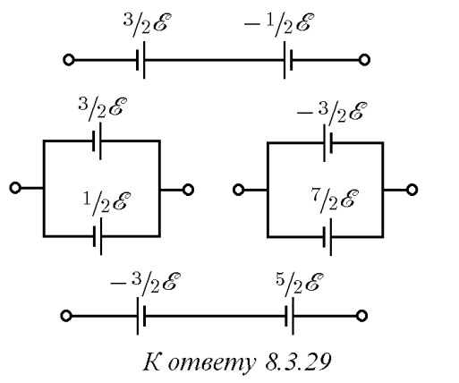

###  Условие: 

$8.3.29.$ Две батареи с одинаковым внутренним сопротивлением соединены так, что ЭДС образовавшегося источника напряжения равна $\varepsilon $. ЭДС одной из батарей $3/2\varepsilon $. Нарисуйте все возможные схемы соединений. Для каждой из схем определите ЭДС второй батареи. 

###  Решение: 

 

 
