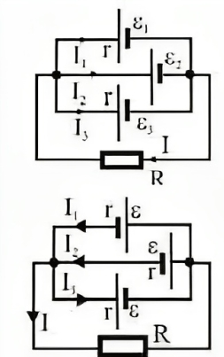
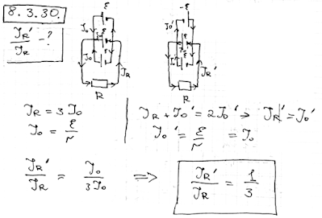

###  Условие: 

$8.3.30.$ Три одинаковые батареи, соединенные параллельно, подключены к внешнему сопротивлению. Как изменится ток через это сопротивление, если переключить полярность одной из батарей? 

###  Решение: 

 

 

###  Ответ: Уменьшится в три раза. 
