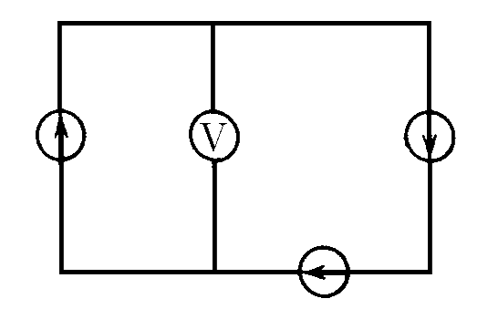

###  Условие: 

$8.3.31.$ Как будут реагировать приборы на перемещение движка реостатов в направлении стрелок на схемах $а–в$ и на замыкание ключей в схеме $г–е$? Внутреннее сопротивление генератора очень мало$^{∗)}$ 

###  Решение: 

Будем считать, что вольтметр обладает бесконечно большим сопротивлением, в этом случае сила тока в цепи определится соотношением 

$$I_0=\frac{\varepsilon +\varepsilon +\varepsilon }{r+r+r}=\frac{\varepsilon }{r}=0.75\,А$$

Поскольку все три элемента в данной схеме включения работают в режиме короткого замыкания, и ток $I_0$, по сути является током короткого замыкания, то в указанных на схеме точках разность потенциалов будет равна нулю. т.е. 

$$U_V=0$$ 

####  Ответ: $V = 0;$ $I = 0.75 \,А$ 
