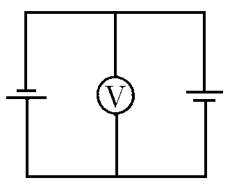
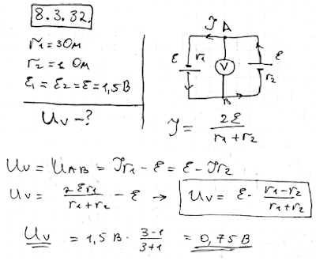

###  Условие:

$8.3.32.$ Найдите показания вольтметра, если внутреннее сопротивление одной батареи $3 \,Ом$, а другой $1 \,Ом$. ЭДС каждой батареи $1.5 \,В$.

###  Решение:

####  Ответ: $V = 0.75 \,В$