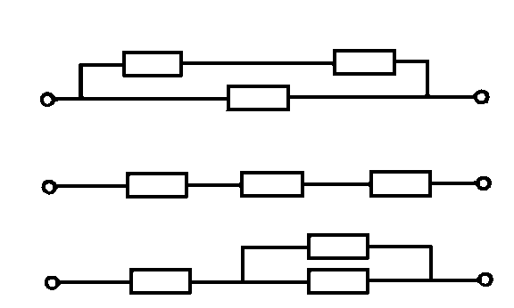

###  Условие:

$8.3.33.$ Электроплитка имеет три секции с одинаковым сопротивлением. При параллельном их соединении вода в чайнике закипает через $6 \,мин$. Через какое время закипит вода той же массы и той же начальной температуры при соединении секций, как показано на рисунке?

###  Решение:

###  Ответ: Через $12$, $54$ и $27$ мин