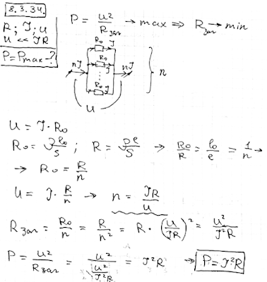

###  Условие:

$8.3.34.$ Имеется проволока с сопротивлением $R$, через которую можно без риска ее пережечь пропускать ток, не превышающий $I$. Какую наибольшую мощность может иметь электрический нагреватель, изготовленный из этой проволоки, при включении в сеть с напряжением $V \ll IR$? Проволоку можно разрезать на куски и соединять последовательно и параллельно.

###  Решение:

###  Ответ: $N = I^2R$