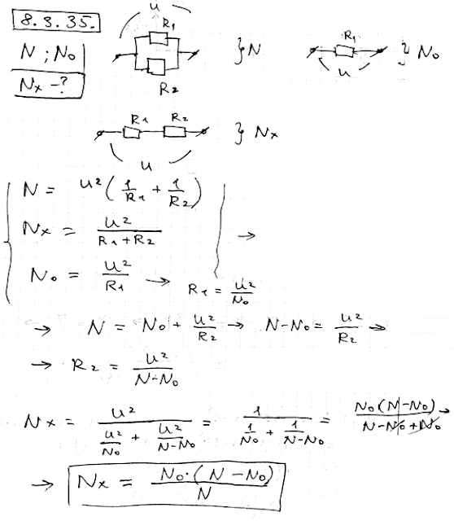

###  Условие: 

$8.3.35.$ Две электроплитки, соединенные в цепь параллельно, потребляют мощность $N$. Какую мощность будут потреблять эти электроплитки, включенные последовательно, если одна из электроплиток потребляет мощность $N_0$? 

###  Решение: 

 

###  Ответ: ${N}' = N_0(N − N_0)/N$ 
