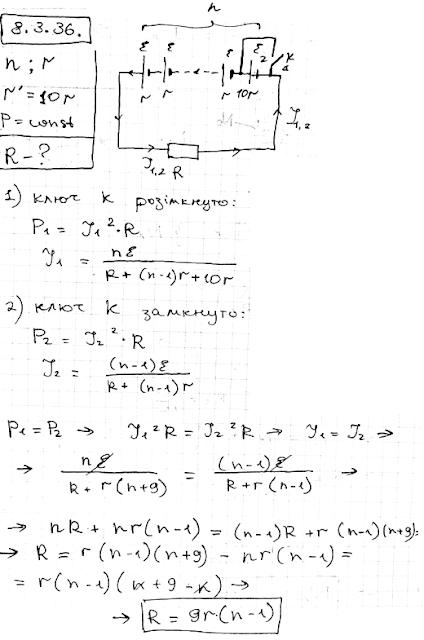

###  Условие:

$8.3.36.$ В старой аккумуляторной батарее, состоящей из $n$ последовательно соединенных аккумуляторов с внутренним сопротивлением $r$, внутреннее сопротивление одного из аккумуляторов резко возросло до $10 \,r$. Считая ЭДС всех аккумуляторов одинаковой, определите, при каком сопротивлении нагрузки мощность, выделяемая на ней, не изменится при коротком замыкании поврежденного аккумулятора.

###  Решение:

###  Ответ: $R = 9(n − 1)r$