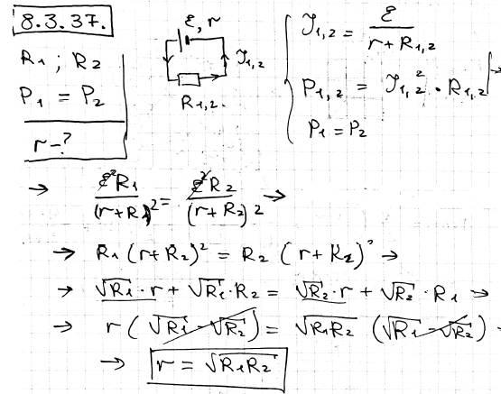

###  Условие: 

$8.3.37.$ Аккумулятор подключен один раз к внешней цепи с сопротивлением $R_1$, другой раз — с $R_2$. При этом количество теплоты, выделяющейся во внешней цепи в единицу времени, одинаково. Определите внутреннее сопротивление аккумулятора. 

###  Решение: 

 

###  Ответ: $r =\sqrt{R_1R_2}$ 
