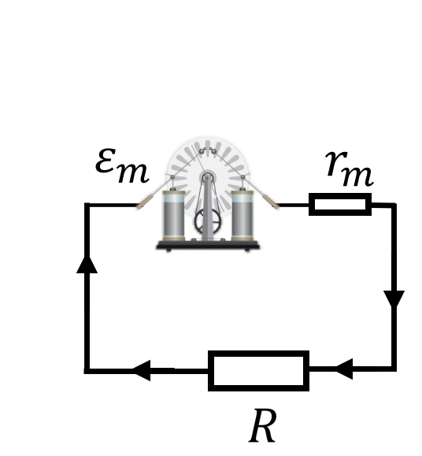

###  Условие:

$8.3.38.$ Сравните напряжение на клеммах, а также мощность, выделяемую во внешней цепи батареей из $50$ элементов, соединенных последовательно и имеющих каждый сопротивление $0.2 ~Ом$ и ЭДС $2 ~В$, если сопротивление внешней цепи $0.2 ~Ом$, и электрофорной машиной, создающей на шаровых кондукторах разность потенциалов $100 ~кВ$ и обладающей внутренним сопротивлением $10^8 ~Ом$, если сопротивлением внешней цепи $10^5 ~Ом$. Как изменится ток и мощность во внешней цепи, если сопротивление ее удвоится?

###  Решение:

#### Решение для случая a:

Элементы соединены последовательно, поэтому:

\[
\mathcal{E}_{\text{экв}} = N \cdot \mathcal{E} = 100 ~ \text{В}.
\]

Общее внутреннее сопротивление батареи:

\[
r_{\text{экв}} = N \cdot r = 10 ~ \text{Ом}.
\]

Общий ток определяется по закону Ома для полной цепи:

\[
I = \frac{\mathcal{E}_{\text{экв}}}{r_{\text{экв}} + R_{\text{внеш}}} = \frac{50\mathcal{E}}{50r+R} \approx 9.8 ~ \text{А}.
\]

Напряжение на клеммах:

\[
U_{\text{клемм}} = I \cdot R = 9.8 \cdot 0.2 \approx 2 ~ \text{В}.
\]

Мощность выделяемая на резисторе $R$:

\[
P_{\text{внеш}} = I^2 \cdot R = 9.8^2 \cdot 0.2 \approx 19.2 ~ \text{Вт}.
\]

#### Решение для случая б:

Для электрофорной машины:

\[
I = \frac{U}{r + R_{\text{внеш}}} = \frac{100000}{10^8 + 10^5} \approx 10^{-3} ~ \text{А}.
\]

Напряжение на клеммах:

\[
U_{\text{клемм}} = I \cdot R_{\text{внеш}} = 10^{-3} \cdot 10^5 = 100 ~ \text{В}.
\]

Мощность во внешней цепи:

\[
P_{\text{внеш}} = I^2 \cdot R_{\text{внеш}} = (10^{-3})^2 \cdot 10^5 = 0.1 ~ \text{Вт}.
\]

При удвоении $R_{\text{внеш}}$ выделяемая мощность на нагрузке увеличиться в два раза из-за прямо-порциональной зависимости от сопротивления. Из-за относительного большого сопротивления источников тока в обоих случаев, общее сопротивление цепи практически не поменяется, а следовательно сила тока почти не изменится.

####  Ответ: $2$ и $100 \mathrm{~В}$; $20$ и $0{,}1 \mathrm{~Вт}$. Ток почти не изменится, мощность же возрастает почти вдвое.