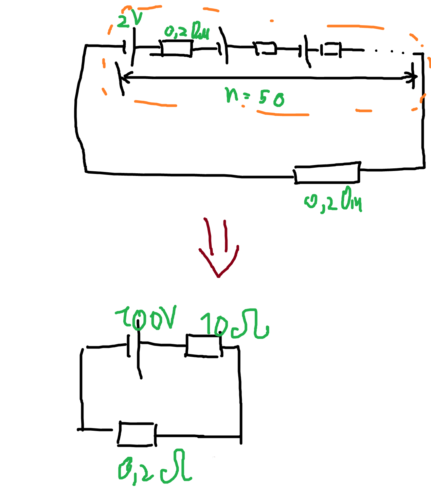
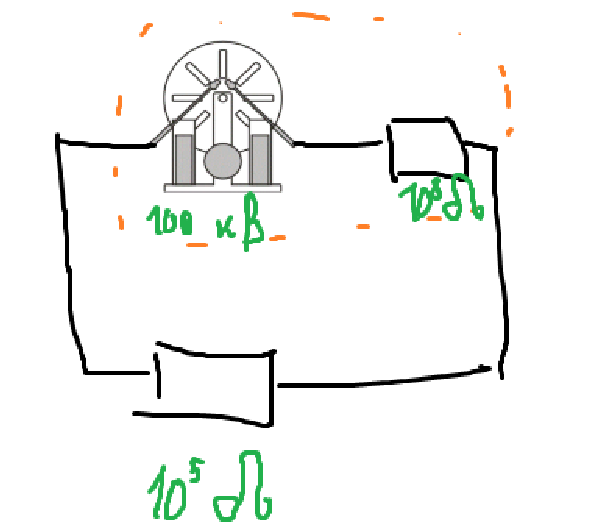
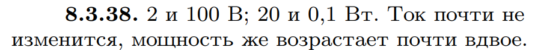

###  Условие: 

$8.3.38.$ Сравните напряжение на клеммах, а также мощность, выделяемую во внешней цепи батареей из $50$ элементов, соединенных последовательно и имеющих каждый сопротивление $0.2 \,Ом$ и ЭДС $2 \,В$, если сопротивление внешней цепи $0.2 \,Ом$, и электрофорной машиной, создающей на шаровых кондукторах разность потенциалов $100 \,кВ$ и обладающей внутренним сопротивлением $10^8 \,Ом$, если сопротивлением внешней цепи $10^5 \,Ом$. Как изменится ток и мощность во внешней цепи, если сопротивление ее удвоится? 

###  Решение: 

Эквивалентные схемы для случаев a)  б)  

###  Ответ:  
  
  

