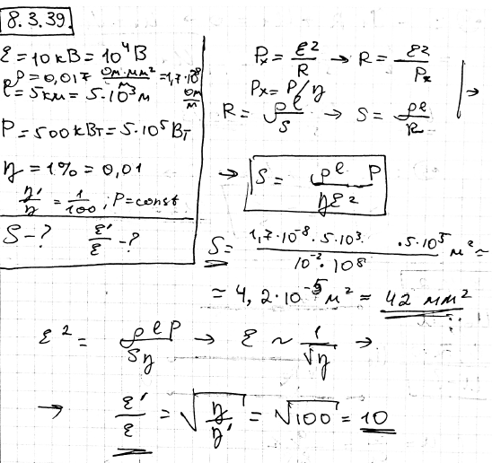

###  Условие:

$8.3.39.$ От источника напряжения $10 \,кВ$ требуется передать на расстояние $5 \,км$ мощность $500 \,кВт$; допустимая потеря напряжения в проводах $1 \,\%$. Каково минимальное сечение медного провода? Во сколько раз следует повысить напряжение источника, чтобы снизить потери мощности в $100$ раз в той же линии при передаче той же мощности?

###  Решение:

###  Ответ: $S = 42 \,мм^2;$ примерно в $10$ раз