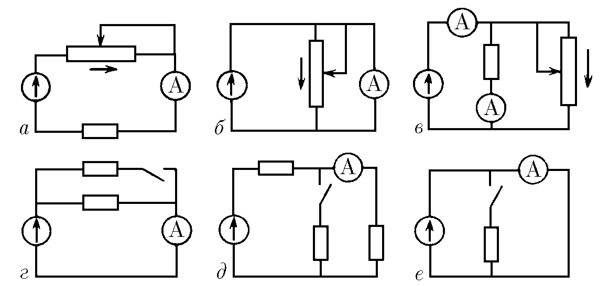
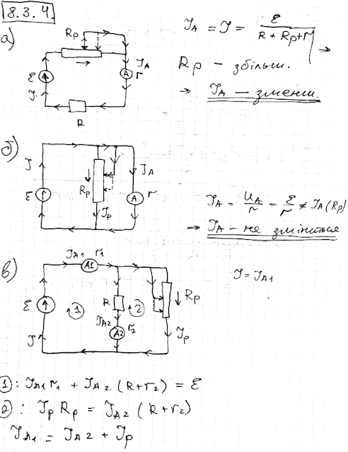
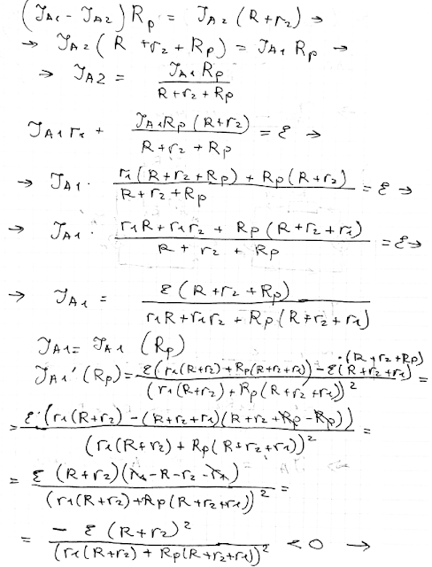
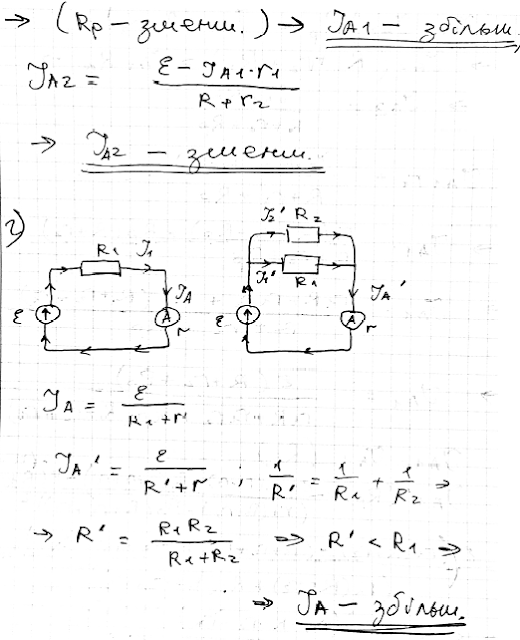
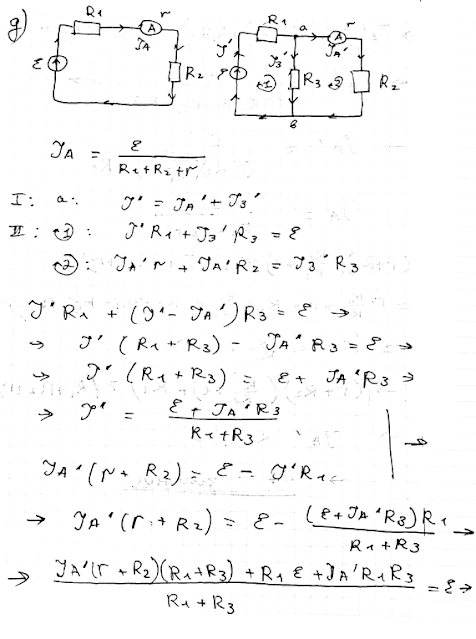
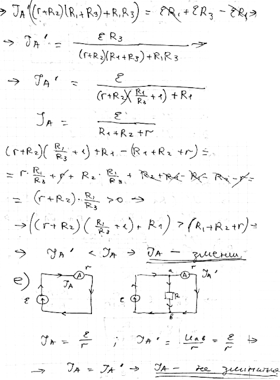
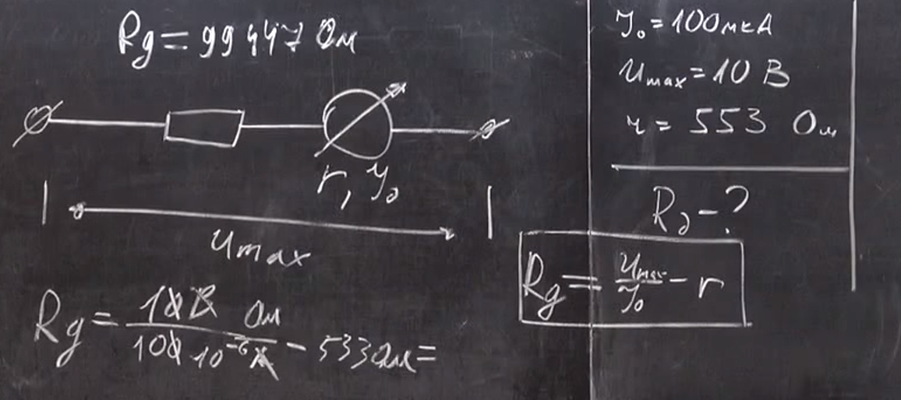

###  Условие: 

$8.3.4.$ Как будут реагировать приборы на перемещение движка реостатов в направлении стрелок на схемах $а–в$ и на замыкание ключей в схеме $г–е$? Внутреннее сопротивление генератора очень мало$^{∗)}$ 

###  Решение: 

 

 

 

 

 

###  Аналогичное решение: 

 

 

В схемах $а$ и $д$ приборы покажут уменьшение тока, в схеме $г$ — возрастание тока, в схеме $b$ и $е$ ток не изменяется. В схеме $в$ верхний амперметр покажет возрастание тока, нижний покажет уменьшение тока. 
