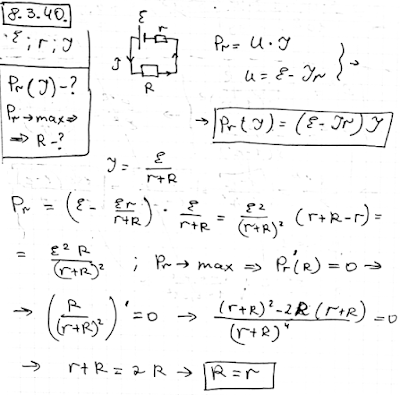

###  Условие:

$8.3.40.$ Как зависит мощность генератора, выделяемая на внутреннем сопротивлении, от тока $I$? Напряжение генератора $E$, внутреннее сопротивление $r$. Какому сопротивлению соответствует максимальная мощность?

###  Решение:

#### Ответ: $N = (\varepsilon − Ir)I;$ $\,R = r$