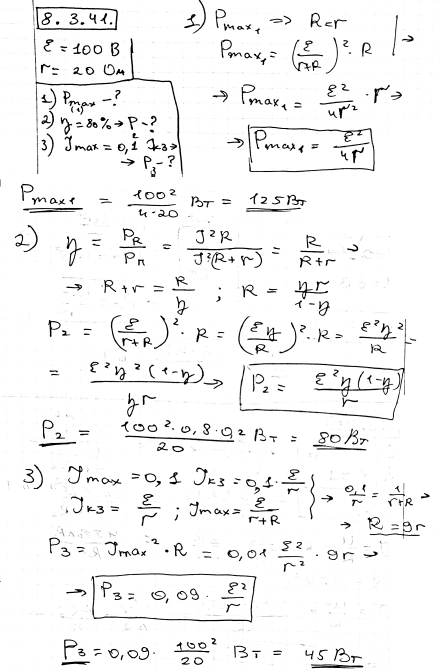
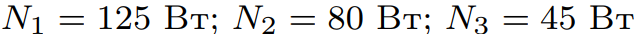

###  Условие: 

$8.3.41.$ Какую наибольшую мощность можно получить от генератора с напряжением $100 \,В$ и внутренним сопротивлением $20 \,Ом$? Какую мощность можно получить от того же генератора при КПД $80 \,\%$? Если максимальный допустимый ток через генератор составляет $0.1$ от тока короткого замыкания, то какую наибольшую мощность можно получить от генератора, не опасаясь его порчи? 

###  Решение: 

 

###  Ответ:  
