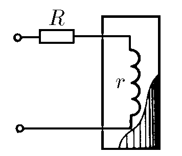
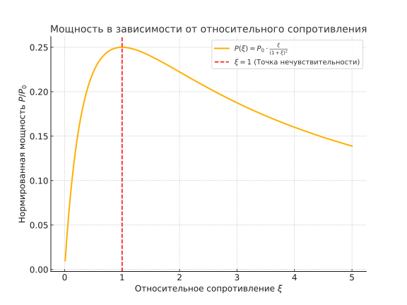

###  Условие:

$8.3.42^*.$ В термостат нужно подводить тепло с постоянной скоростью. Во время опыта в нем изменяется температура, что вызывает изменение сопротивления нагревательной спирали. Нужно, чтобы выделяемая на сопротивлении спирали $r$ мощность почти не менялась при малых изменениях $r$. Постройте график зависимости мощности от $r$ и определите, используя этот график, при каком соотношении $R$ и $r$ достигается желаемая нечувствительность мощности к изменению $r$.

###  Решение:

Сила тока в цепи:

$$
I = \frac{\mathcal{E}}{R+r}\tag{1}
$$

Мощность выделяемая на сопротивлении спирали $r$

$$
P = I^2r = \frac{\mathcal{E}^2r}{(R+r)^2}\tag{2}
$$

Введём безмерную относительную величину $\xi$:

$$
\xi = \frac{r}{R} \Rightarrow r = \xi R\tag{3}
$$

Учитывая безразмерный коэффицент, перепишем уравнение для выделяющуейся мощности $(2)$

$$
P = P_0 \cdot \frac{\xi}{(1+\xi)^2}\tag{4}
$$

где $P_0=\frac{\mathcal{E}^2}{R}$

Чтобы удовлетворить условие необходимо, чтобы касательная к графику в данной точке имелла наименьший угол наклона к горизонтале. В этом случае выделяемая на сопротивлении спирали $r$ мощность почти не изменяется при малых изменениях $r$.

Из графика полученной зависимости $(4)$ получаем, что касательная располагается горизонтально в точке локального максимума при $\xi = 1$, так называемое явление резонанса. Из $(3)$ получается, что искомое соотношении определяется как

$$
r = R
$$

####  Ответ: При $r = R$