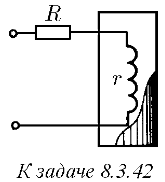

###  Условие: 

$8.3.42^*.$ В термостат нужно подводить тепло с постоянной скоростью. Во время опыта в нем изменяется температура, что вызывает изменение сопротивления нагревательной спирали. Нужно, чтобы выделяемая на сопротивлении спирали $r$ мощность почти не менялась при малых изменениях $r$. Постройте график зависимости мощности от $r$ и определите, используя этот график, при каком соотношении $R$ и $r$ достигается желаемая нечувствительность мощности к изменению $r$. 

 

###  Решение: При $r = R$ 
