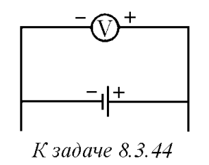

###  Условие: 

$8.3.44.$ Батарея с ЭДС 4 В и внутренним сопротивлением 1 Ом входит в состав неизвестной цепи. К полюсам батареи подключен вольтметр, он показывает напряжение 6 В. Определите количество теплоты, выделяющейся в единицу времени на внутреннем сопротивлении батареи. 

 

###  Решение: 

$Q/t * r = i ^ 2 * r$ $U= \varepsilon +ir$$\rightarrow i=\frac{U-\varepsilon }{r}=2\,A$ $\frac{Qr}{t}=4 \,Вт$ 

###  Ответ: $N = 4 \,Вт$ 
