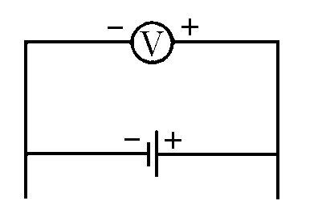

###  Условие:

$8.3.44.$ Батарея с ЭДС $4 \mathrm{~В}$ и внутренним сопротивлением $1 \mathrm{~Ом}$ входит в состав неизвестной цепи. К полюсам батареи подключен вольтметр, он показывает напряжение $6 \mathrm{~В}$. Определите количество теплоты, выделяющейся в единицу времени на внутреннем сопротивлении батареи.

###  Решение:

Количество теплоты, выделяющееся в единицу времени на внутреннем сопротивлении, вычисляется по формуле:

$$
Q/t \cdot r = i ^ 2 \cdot r\tag{1}
$$

Напряжением на полюсах батареи:

$$
U= \varepsilon +ir\tag{2}
$$

Выражаем силу тока $i$:

$$
i=\frac{U-\varepsilon }{r}=2\,A\tag{3}
$$

Подставляем уравнение для силы тока $(3)$ в выражение для количества теплоты, выделяющееся на внутреннем сопротивлении батареи в единицу времени $(1)$:

$$
N = \frac{Qr}{t}=4 \,Вт\tag{4}
$$

#### Ответ: $N = 4 \,Вт$