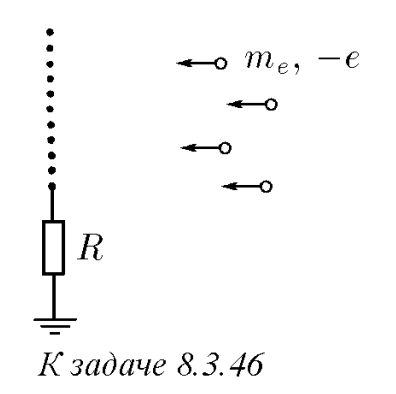

###  Условие: 

$8.3.46$ Зонд, представляющий собой медную сетку, заземлен через сопротивление $R$ и помещен в пучок электронов, скорость которых на большом расстоянии от зонда равна $v$. Определите количество теплоты, выделяющейся в единицу времени при бомбардировке зонда электронами, если ток заземления равен $I$. 

 

###  Решение: 

$\Delta \varphi = IR \rightarrow \varphi_з = 0$ $\frac{mv^2}{2}=e {\varphi}'$$\rightarrow {\varphi}' = \frac{mv^2}{2e}$ $\frac{Q}{\Delta t} = IU$$ $$= I({\varphi}'-\varphi)$$ = I \Delta{\varphi}'$$=I(\frac{mv^2}{2e}-IR)$ 

###  Ответ: $N = I(m_ev^2/2e − IR)$ 
