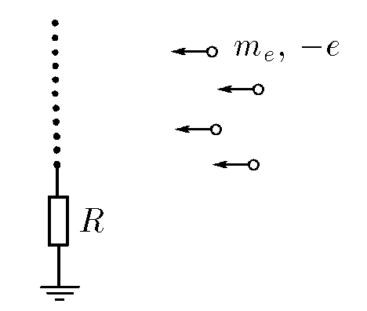

###  Условие: 

$8.3.46$ Зонд, представляющий собой медную сетку, заземлен через сопротивление $R$ и помещен в пучок электронов, скорость которых на большом расстоянии от зонда равна $v$. Определите количество теплоты, выделяющейся в единицу времени при бомбардировке зонда электронами, если ток заземления равен $I$. 

###  Решение: 

$$\Delta \varphi = IR \rightarrow \varphi_з = 0$$ 

$$\frac{mv^2}{2}=e {\varphi}'\rightarrow {\varphi}' = \frac{mv^2}{2e}$$ 

$$N=\frac{Q}{\Delta t} = IU$$ 

$$N = I({\varphi}'-\varphi) = I \Delta{\varphi}'=I\left(\frac{mv^2}{2e}-IR\right)$$

####  Ответ: $N = I(m_ev^2/2e − IR)$ 
