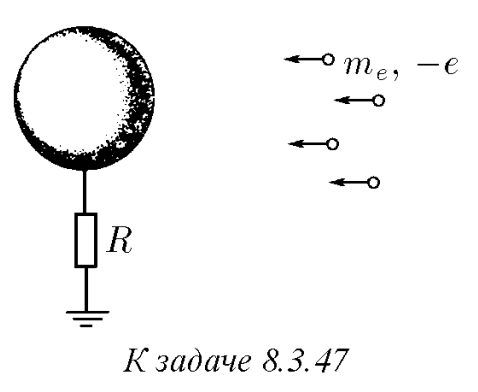
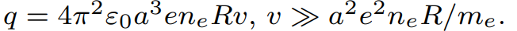

###  Условие: 

$8.3.47.$ Шар радиуса $a$ через сопротивление $R$ соединен с землей. Из бесконечности на него со скоростью $v$ налетает пучок электронов, число частиц в единице объема которого $n_e$. Определите предельный заряд шара. Считать скорость частиц большой (подумайте, по сравнению с какой величиной). 

 

###  Решение: 

 

###  Ответ:  
