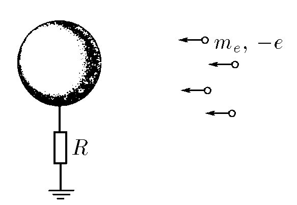
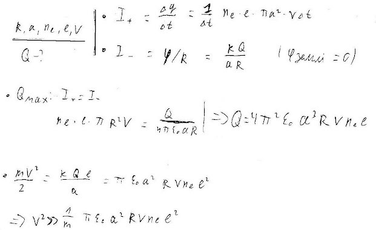

###  Условие:

$8.3.47.$ Шар радиуса $a$ через сопротивление $R$ соединен с землей. Из бесконечности на него со скоростью $v$ налетает пучок электронов, число частиц в единице объема которого $n_e$. Определите предельный заряд шара. Считать скорость частиц большой (подумайте, по сравнению с какой величиной).

###  Решение:

#### Ответ: $q=4\pi^2\varepsilon_0a^3en_eRv,~v\gg a^2e^2n_eR/m_e.$