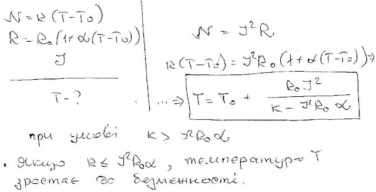
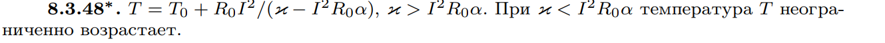

###  Условие: 

$8.3.48^*.$ Тепловая мощность спирали электроплитки линейно зависит от разности температур спирали и комнатного воздуха: $N = \kappa (T −T_0)$. Сопротивление спирали тоже линейно зависит от этой разности: $R = R_0[1 +\alpha (T −T_0)]$, где $R_0$ — сопротивление спирали при комнатной температуре. До какой температуры нагреется спираль при пропускании через нее тока $I$? 

###  Решение: 

 

###  Ответ: 

 
