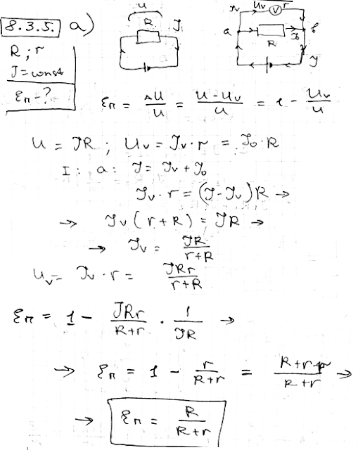

###  Условие:

$8.3.5.$ а. Требуется определить падение напряжения на сопротивлении $R$. Для этого к концам сопротивления подключают вольтметр. Какая относительная погрешность будет допущена при измерениях, если показания вольтметра принять за то, которое имело место до его подключения? Сила тока в цепи поддерживается постоянной. Сопротивление вольтметра $r$. б. Для измерения тока в цепи с сопротивлением $R$ включен амперметр. Какая относительная ошибка будет допущена, если считать, что включение амперметра не изменило тока? Напряжение на концах цепи поддерживается постоянным. Сопротивление амперметра $r$.

###  Решение:

####  Ответ: $\mathrm{a.~}\Delta V/V=R/(R+r).\quad\mathrm{~б.~}\Delta I/I=r/(R+r).$