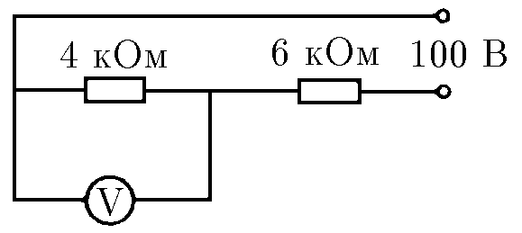

###  Условие:

$8.3.6.$ Вольтметр включен параллельно сопротивлению $4 \,кОм$ и показывает $36 \,В$. Напряжение на клеммах источника тока поддерживается постоянным и равным $100 \,В$. Найдите отношение тока, идущего через вольтметр, к току, идущему через сопротивление $6 \,кОм$. Что покажет этот вольтметр, если заменить сопротивления соответственно на $4$ и $6 \,Ом$?

###  Решение:

Напряжение $U_2$ на резисторе с сопротивлением $r_2$ равно $U–U_1$, а сила тока, идущего через этот резистор, определяется по закону Ома:

$$
I_{2}=\frac{U-U_{1}}{r_{2}}
$$

Аналогично, ток через резистор $r_1$:

$$
I_{1}=\frac{U_{1}}{r_{1}}
$$

где $I_1$ — сила тока, идущего через резистор с сопротивлением $r_1$, а $I_в$ — сила тока, идущего через вольтметр.

Так как $I_{1}=\frac{U_{1}}{r_{1}}$, то

$$
I_{в}=I_{2}- \frac{U_{1}}{r_{1}}
$$

Отношение токов проходящего через вольтметр к силе тока через резистор $r_2$:

$$
\frac{I_{в}}{I_{2}} = 1 - \frac{U_{1}}{I_{2}r_{1}}
$$

$$
\frac{I_{в}}{I_{2}} = 1 - \frac{U_{1}r_{2}}{(U-U_{1})r_{1}} =\frac{5}{32}
$$

####  Ответ: $I_V /I_6 = 10/64,~V \approx 40 \,В$