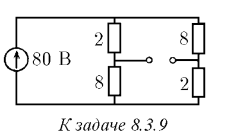
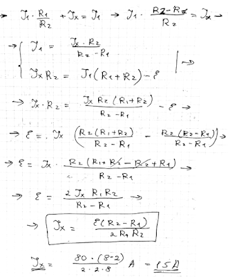
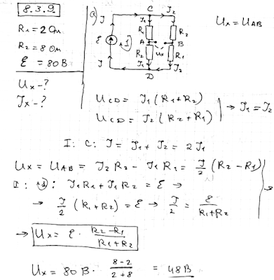
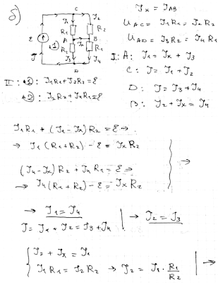

###  Условие: 

$8.3.9.$ Чему равна разность потенциалов между клеммами в схеме на рисунке? Что покажет амперметр, если его подключить к клеммам$^{∗)}$ ? 

 

###  Решение: 

 

 

 

###  Ответ: $V = 48 \,В;$ $I = 15 \,А$ 
