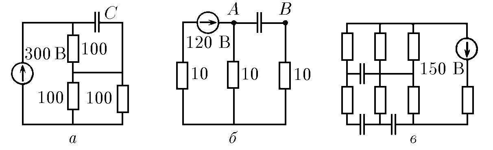
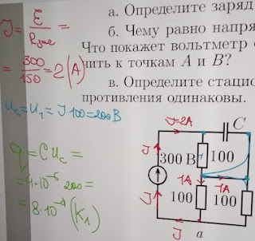
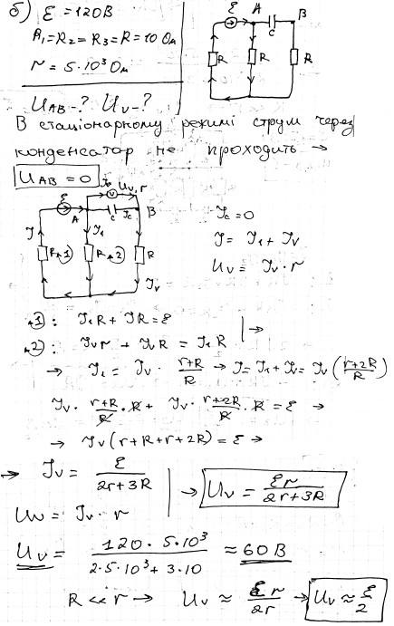

###  Условие: 

$8.4.1.$ Схемы цепей постоянного тока с конденсаторами даны на рисунке. а. Определите заряд конденсатора емкости $4 \,мкФ$ в стационарном режиме. б. Чему равно напряжение между точками $A$ и $B$ в стационарном режиме? Что покажет вольтметр с внутренним сопротивлением $5 \,кОм$, если его подключить к точкам $A$ и $B$? в. Определите стационарное напряжение на всех конденсаторах, если все сопротивления одинаковы. 

###  Решение: 

 

###  Альтернативное решение: 

 

####  Ответ: a. $q=8\cdot10^{-4}\mathrm{~Кл}.\quad$ б. $V=60\mathrm{~В}.\quad$ в. $30,30,60\mathrm{~В}.$
