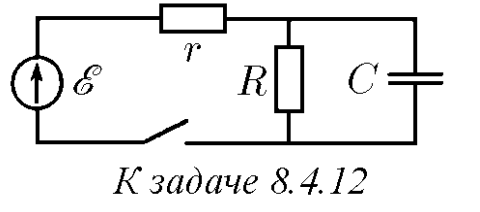

###  Условие: 

$8.4.12.$ Как будут реагировать приборы на перемещение движка реостатов в направлении стрелок на схемах $а–в$ и на замыкание ключей в схеме $г–е$? Внутреннее сопротивление генератора очень мало$^{∗)}$ 

 

###  Решение: 

 

###  Альтернативное решение: 

 

###  Ответ: Через $\tau\approx 10^{−3}RC$ 
