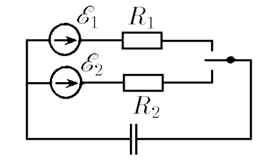

###  Условие: 

$8.4.13^*.$ Ключ замыкают поочередно с каждым из контактов на очень малые одинаковые промежутки времени. Изменение заряда конденсатора, происходящее за время каждого включения, очень малой. Какой заряд окажется на конденсаторе после большого числа переключений? Определите заряд конденсатора в случае, когда время, в течение которого замкнута первая цепь, в $k$ раз меньше времени, в течение которого замкнута вторая цепь. 

###  Решение: 

Рассмотрим установившийся режим, когда напряжение на конденсаторе практически не меняется и равно в среднем $U_{уст}$. При очередном замыкании ключа в положение $I$ за небольшой интервал времени $Δt$ заряд конденсатора изменится на величину 

$$\Delta t (\varepsilon_{1}-U_{уст})/R_{1}.$$

При замыкании ключа в положение $2$ заряд изменится на величину

$$\Delta t (\varepsilon_{2}-U_{уст})/R_{2}$$

Суммарное изменение заряда за цикл должно быть равно нулю:

$$(\varepsilon_{1}-U_{уст})/R_{1} + (\varepsilon_{2}-U_{уст})/R_{2}=0.$$

Отсюда напряжение $U_{уст}$ и заряд конденсатора $q_{уст}$, в установившемся режиме найдем по формулам 

$$U_{уст}=(\varepsilon_{2}R_{1}+\varepsilon_{1}R_{2})/(R_{1}+R_{2}),$$ $$q_{уст}=CU_{уст}=C(\varepsilon_{2}R_{1}+\varepsilon_{1}R_{2})/(R_{1}+R_{2})$$ 

####  Ответ: $q = C \frac{\varepsilon_1 R_2 + \varepsilon_2 R_1}{R_1+R_2};$ $q = C \frac{\varepsilon_1 R_2 + k\varepsilon_2 R_1}{kR_1+R_2};$ 
