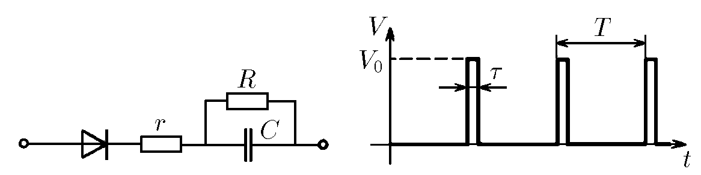

###  Условие:

$8.4.14^*.$ На вход схемы подаются периодически повторяющиеся прямоугольные импульсы напряжения $V_0$. Продолжительность импульса $\tau$, период повторения $T$. Импульсы подаются через диод, который можно считать идеальным ключом. Определите напряжение, установившееся на конденсаторе, если за каждый период напряжение на нем изменится очень мало.

###  Решение:

Когда в цепи установится равновесие, напряжение, а значит, и заряд на конденсаторе меняться не будут. То есть увеличение заряда при зарядке будет равно уменьшению заряда при разрядке. При зарядке конденсатора в течение времени $\tau$ напряжение на нем равно

$$
U_{C} = U_{0} - I_{з}r,
$$

Так как за период заряд на конденсаторе меняется очень мало, то можно считать зарядный ток постоянным и равным

$$
I_{з} = \frac{ \Delta q}{ \tau},
$$

где $\Delta q$ - изменение заряда. Таким образом,

$$
U_{C} = U_{0} - \frac{ \Delta q}{ \tau} r \tag{1}
$$

При разрядке конденсатор разряжается через сопротивление $R$ в течение времени $T−\tau$, поэтому $U_{C} = I_{p}R$, где разрядный ток

$$
I_{p} = \frac{ \Delta q}{T - \tau}.
$$

Следовательно, во время разрядки

$$
U_{C} = \frac{ \Delta q }{T - \tau} R \tag{2}
$$

Решая совместно $(1)$ и $(2)$, получим

$$
U_{C} = U_{0} \frac{R \tau}{(R - r) \tau + rT}
$$

#### Ответ: $V = V_0R\tau /(rT + R\tau )$