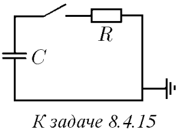
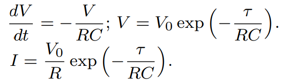

###  Условие: 

$8.4.15^*.$ Конденсатор емкости $C$, заряженный до напряжения $V_0$, после замыкания ключа разряжается через сопротивление $R$. Как связана скорость изменения напряжения на конденсаторе $dV /dt$ с напряжением на нем? Чему равны напряжение на конденсаторе и ток в цепи через время $\tau$ после замыкания ключа? 

 

###  Решение: 

 

###  Ответ: 

 
