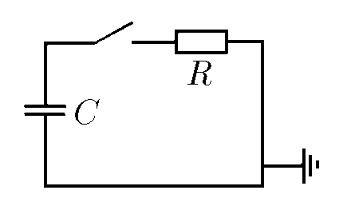
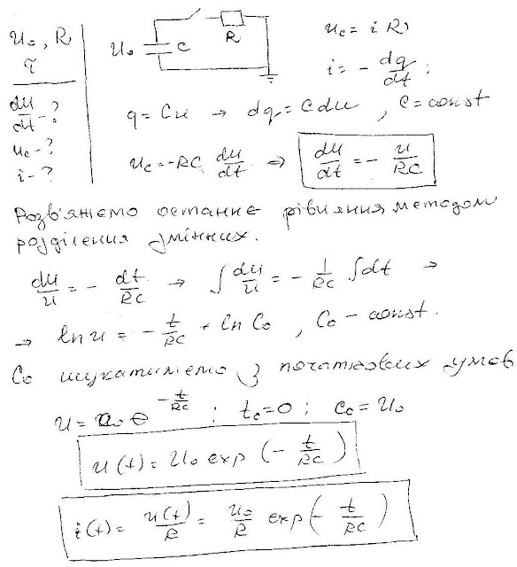

###  Условие:

$8.4.15^*.$ Конденсатор емкости $C$, заряженный до напряжения $V_0$, после замыкания ключа разряжается через сопротивление $R$. Как связана скорость изменения напряжения на конденсаторе $dV /dt$ с напряжением на нем? Чему равны напряжение на конденсаторе и ток в цепи через время $\tau$ после замыкания ключа?

###  Решение:

#### Ответ: $\frac{dV}{dt}=-\frac{V}{RC};$ $V=V_0\exp\left(-\frac{\tau}{RC}\right).\quad$$I=\frac{V_0}{R}\exp\left(-\frac{\tau}{RC}\right).$