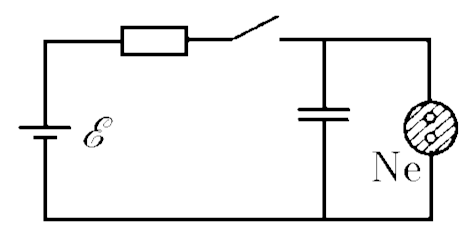
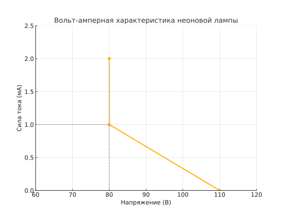

###  Условие:

$8.4.16.$ Включение неоновой лампы осуществляется с помощью схемы, показанной на рисунке. После замыкания ключа конденсатор начнет заряжаться. Когда напряжение на конденсаторе достигнет некоторого значения $V$, лампа загорится. Минимальное напряжение на лампе, при котором она еще горит, $80 \mathrm{~В}$; при этом ток через лампу $1 \mathrm{~мА}$. ЭДС батареи $120 \mathrm{~В}$, $80 \mathrm{~В} < V < 120 \mathrm{~В}$. При каком сопротивлении лампа будет стационарно гореть (не будет гаснуть)?

###  Решение:

При замыкании ключа конденсатор начинает заряжаться. Когда напряжение на конденсаторе, а следовательно, и на лампе станет равным $110 \,В$ лампа загорится. С этого момента ток, текущий через лампу, будет возрастать, а напряжение на лампе и, следовательно, на конденсаторе будет падать - конденсатор будет разряжаться. Если в процессе разрядки напряжение на конденсаторе станет меньше $80 \,В$, лампа погаснет - ток в цепи меньше номинального тока, текущего через лампу при напряжении $∼80\, В$ (см. рис.). Следовательно, чтобы лампа не гасла, напряжение на конденсаторе не должно в процессе разрядки падать ниже $80 \,В$. В предельном случае, когда $U_{C} = 80 \,В$ , напряжение на резисторе равно $40 \,В$, ток, текущий через резистор, равен току, текущему через лампу ($1 \,мкА$), и, следовательно, сопротивление резистора $R=40\,Ом$. При меньшем значении сопротивления $U_{C} < 80 \,В$ и лампа не горит.

#### Ответ: $R < 40 \,кОм$