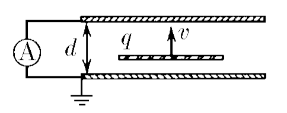
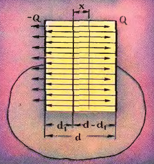

###  Условие:

$8.4.18.$ а. Между пластинами конденсатора с постоянной скоростью $v$ движется равномерно заряженная тонкая пластина, заряд которой $q$. Определите ток в цепи, если конденсатор замкнут накоротко, а расстояние между пластинами $d$. б. Изменится ли результат, если внутри конденсатора перпендикулярно пластинам со скоростью $v$ движется точечная частица с зарядом $q$?

###  Решение:

Для решения задачи нам необходимо знать, какое поле создает большая однородно заряженная пластина (большая по сравнению с расстоянием от пластины до точки, поле в которой нас интересует). Будем исходить из того, что, как мы знаем, электрическое поле в плоском конденсаторе равно

$$
\frac{u}{d } = \frac{Q}{C_{d} } = \frac{Q}{ \varepsilon_{0}S },
$$

где $C$ - емкость конденсатора, $u$ - разность потенциалов между его пластинами, $Q$ - заряд конденсатора, $S$ - площадь пластин, $d$ - расстояние между пластинами и $\varepsilon_{0}$ - электрическая постоянная. Но поле в конденсаторе равно сумме полей, создаваемых его пластинами. Это означает, что каждая из пластин конденсатора создает ноле, равное

$$
\frac{1}{2} \frac{Q}{ \varepsilon_{0}S }.
$$

Такое поле должна создавать н просто одна большая равномерно заряженная пластина.

Таким образом, мы нашли, что средняя подвижная пластина создает поле

$$
\frac{1}{2} \frac{q}{ \varepsilon_{0}S }.
$$

Но поле системы зарядов равно сумме нолей, создаваемых каждым из зарядов в отдельности. Поэтому поле между обкладками равно сумме полей, создаваемых обкладками и перемещаемой пластиной. Будем считать, что суммарный заряд накоротко замкнутых пластин равен нулю (Нетрудно обобщить задачу на случай, когда суммарный заряд обкладок конденсатора не равен нулю. Ответ в этом случае остается прежним.). Тогда, если заряд одной из обкладок равен $Q$, то заряд второй обкладки равен минус $Q$, и поле, создаваемое этими пластинами, точно такое же, как поле в конденсаторе с зарядом $Q$:

$$
E = \frac{Q}{ \varepsilon_{0}S }.
$$

С одной стороны от пластины поля обкладок и подвижной пластины направлены в одну сторон), с другой — в противоположную. Поэтому слева от пластины (рис.) (для определенности мы считаем, что $q>0$) поле

$$
E_{1} = \frac{1}{2} \frac{q}{ \varepsilon_{0}S } + \frac{Q}{ \varepsilon_{0}S } = \frac{q + 2Q}{ \varepsilon_{0}S },
$$

а справа от нее поле

$$
E_{2} = \frac{Q}{ \varepsilon_{0}S } - \frac{1}{2} \frac{q}{ \varepsilon_{0}S } = \frac{2Q - q}{ \varepsilon_{0}S }.
$$

Работа, необходимая для того, чтобы перенести единичный положительный заряд от одной обкладки нашего кондесатора к другой, равна

$$
A = E_{1}d_{1} + E_{2}d_{2}.
$$

Но ведь конденсатор накоротко замкнут, и разность потенциалов между обкладками равна нулю. Следовательно,

$$
E_{1}d_{1} + E_{2}d_{2} = 0.
$$

Или

$$
\frac{2Q + q}{2 \varepsilon_{0}S } d_{1} + \frac{2Q - q}{2 \varepsilon_{0}S } (d - d_{1} ) = 0.
$$

Упростив это уравнение, получим

$$
Q(d - d_{1}) + qd_{1} = 0 \tag{1}
$$

Когда средняя пластина передвинется на расстояние $x$, по проводу, соединяющему обкладки, пройдет заряд $\Delta Q$, и заряды обкладок будут равны $Q+ΔQ$ и $−Q−ΔQ$. Так как и в этим случае разность потенциалов между обкладками равна нулю, то, рассуждая так же, как в нервом случае, получим уравнение

$$
\frac{q + 2(Q - \Delta Q)}{2 \varepsilon_{0}S } (d_{1} + x ) + \frac{2(Q - \Delta Q) - q }{2 \varepsilon_{0}S } (d - d_{1} - x ) = 0
$$

или

$$
(Q - \Delta Q)(d 0 d_{1} - x) + q(d_{1} + x) = 0 \tag{2}
$$

Вычитая из уравнения $(2)$ уравнение $(1)$. найдем, что

$$
\Delta Q = dQ = q \frac{dx}{d} \tag{3}
$$

Домножим $(3)$ на $\frac{1}{dt}$:

$$
\frac{dQ}{dt}=q \frac{dx}{dt} \cdot \frac{1}{d}
$$

Т.к. Сила тока $I = \frac{dQ}{dt}:$

$$
I = \frac{qv}{d}
$$

#### Ответ: а. $I = qv/d$. б. Нет.