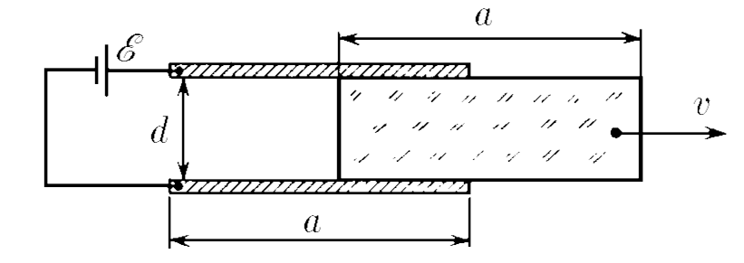
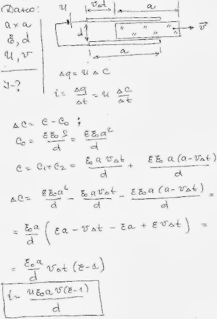

###  Условие:

$8.4.19.$ Между обкладками плоского конденсатора, размеры которых $a × a$, находится плоская пластина такого же размера, заполняющая весь объем между ними. Диэлектрическая проницаемость пластины $\varepsilon $, ее толщина $d$. Между обкладками поддерживается постоянное напряжение $E$. Какой ток идет в цепи конденсатора, если пластину с постоянной скоростью $v$, направленной вдоль одной из сторон обкладок, вынимают из конденсатора?

###  Решение:

#### Ответ: $I = \varepsilon_0(\varepsilon − 1)Eav/d$