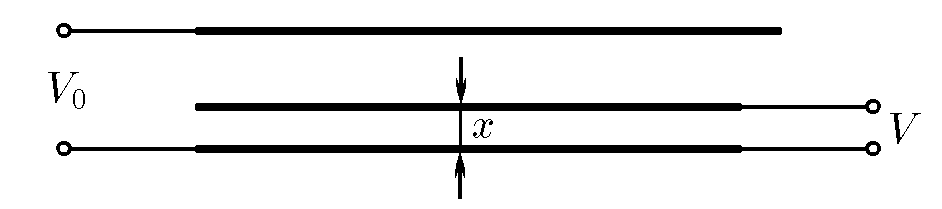

###  Условие:

$8.4.2.$ К закрепленным внешним пластинам подключен источник эталонного напряжения $V_0$. Измеряемое напряжение $V$ подается на нижнюю внешнюю пластину и подвижную внутреннюю, имеющую ту же площадь, что и внешние пластины. Подвижную пластину перемещают в зазоре, пока действующая на нее электрическая сила не обратится в нуль, и измеряют расстояние $x$ от нее до нижней внешней пластины. Найдите $V$, если расстояние между внешними пластинами $l$, а размеры пластин много больше этого расстояния. Как изменить схему подключения, чтобы измерять напряжения $V > V_0$?

###  Решение:

####  Ответ: $V = V_0x/(2x − l)$; поменять местами источники.