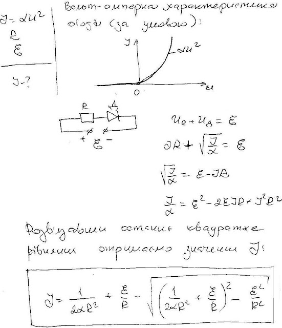

###  Условие:

$8.4.20.$ При положительном напряжении $V$ на диоде ток через диод $I = \alpha V^2;$ при отрицательном напряжении ток через него равен нулю. Найдите ток в цепи, если этот диод через сопротивление $R$ подключен к батарее с ЭДС $E$.

###  Решение:

###  Ответ:

$$
I=\frac{1}{2\alpha R^2}+\frac{\mathcal{E}}{R}-\left[\left(\frac{1}{2\alpha R^2}+\frac{\mathcal{E}}{R}\right)^2-\frac{\mathcal{E}^2}{R^2}\right]^{1/2}.
$$