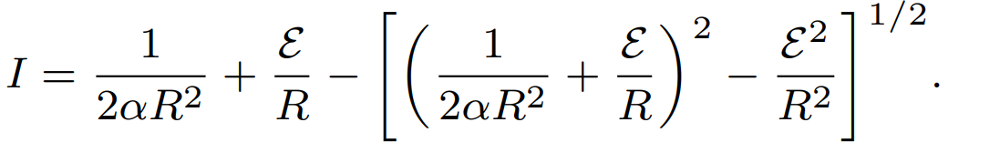

###  Условие: 

$8.4.20.$ При положительном напряжении $V$ на диоде ток через диод $I = \alpha V^2;$ при отрицательном напряжении ток через него равен нулю. Найдите ток в цепи, если этот диод через сопротивление R подключен к батарее с ЭДС $E$. 

###  Решение: 

 

###  Ответ: 

 
