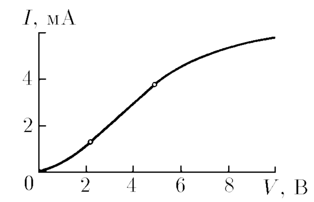
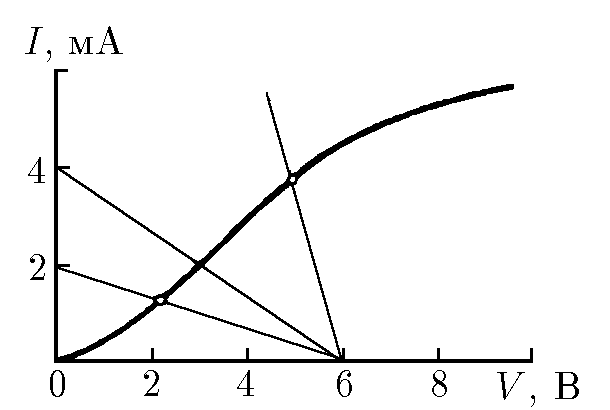

###  Условие:

$8.4.21.$ Диод с вольт-амперной характеристикой, изображенной на рисунке, подсоединен к батарее с ЕДС $6 \,В$ через сопротивление $1.5 \,кОм$. Определите ток в цепи. При каком сопротивлении диод перестает работать на прямолинейном участке характеристики?

###  Решение:

На вольт-амперной характеристике проводим прямую $I = (E − V )/R;$ точка их пересечения дает ток $2 \,мА$. Проводя соответствующие прямые через концы прямолинейного участка характеристики, находим, что при $R > 0.3 \,кОм$ и $R > 3 \,кОм$ диод перестает работать на прямолинейном участке вольт-амперной характеристики.