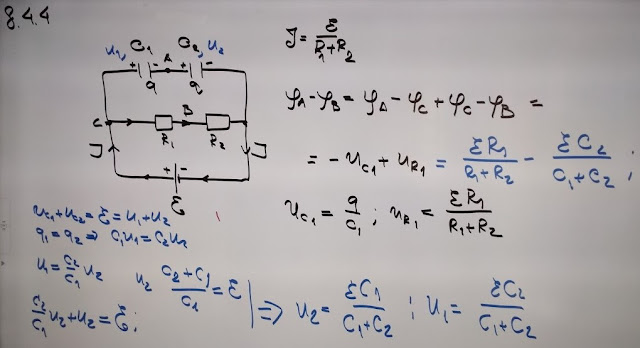
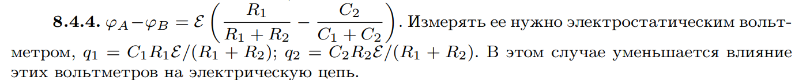

###  Условие: 

$8.4.4.$ Определите разность потенциалов между точками $A$ и $B$. Каким вольтметром ее следует измерять? Какие заряды будут на конденсаторах при присоединении электромагнитного вольтметра? Почему электромагнитный вольтметр тем лучше, чем больше его внутреннее сопротивление, а электростатический вольтметр — чем меньше его емкость? 

###  Решение: 

 

###  Ответ: 

 
