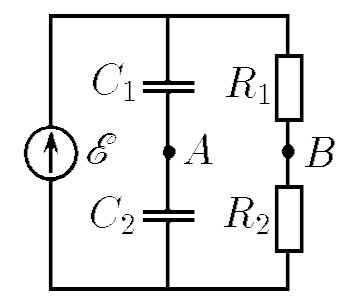

###  Условие: 

$8.4.4.$ Определите разность потенциалов между точками $A$ и $B$. Каким вольтметром ее следует измерять? Какие заряды будут на конденсаторах при присоединении электромагнитного вольтметра? Почему электромагнитный вольтметр тем лучше, чем больше его внутреннее сопротивление, а электростатический вольтметр — чем меньше его емкость? 

###  Решение: 

 

#### Ответ: 

$\varphi_A-\varphi_B=\mathcal{E}\left(\frac{R_1}{R_1+R_2}-\frac{C_2}{C_1+C_2}\right).$ Измерять ее нужно электростатическим вольтметром, $q_1=C_1R_1\mathcal{E}/(R_1+R_2)$; $q_2=C_2R_2\mathcal{E}/(R_1+R_2)$. В этом случае уменьшается влияние этих вольтметров на электрическую цепь.

