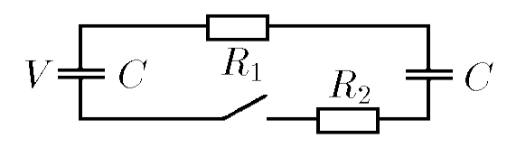
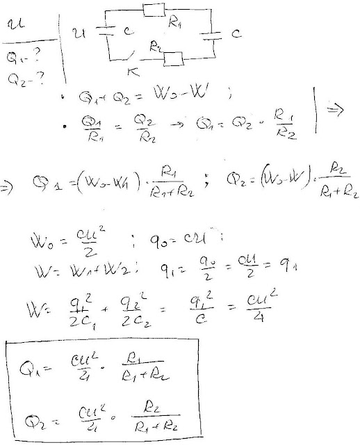

###  Условие: 

$8.4.5^*.$ Найдите количество теплоты, выделившейся на каждом сопротивлении после замыкания ключа. Один конденсатор вначале был заряжен до напряжения $V$, а второй не был заряжен. 

###  Решение: 

 

####  Ответ: $W_1 = \frac{CV^2}{4} \frac{R_1}{R_1+R_2};$ $\,W_2 = \frac{CV^2}{4} \frac{R_2}{R_1+R_2};$ 
