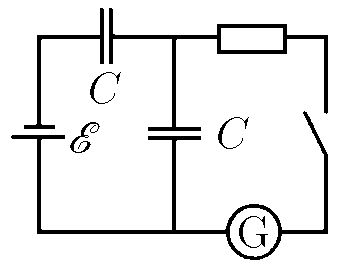
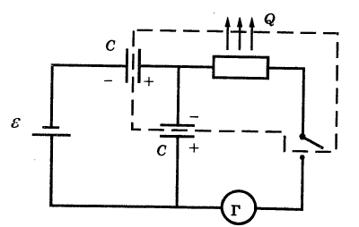

###  Условие:

$8.4.7.$ Какой заряд протечет через гальванометр после замыкания ключа? Какое количество теплоты выделится на сопротивлении?

###  Решение:

До замыкания ключа простой расчет дает:

$$
\varepsilon = \frac{q_{1}}{C} + \frac{q_{1}}{C} = \frac{2q_{1}}{C}, \tag{1}
$$

где $q_1$ — заряд каждого из конденсаторов. После замыкания ключа с установлением равновесного распределения зарядов (прекращения тока в цепи) нижний конденсатор не заряжен, а заряд верхнего определяется из уравнения:

$$
\varepsilon = \frac{q_{2}}{C} \tag{2}
$$

Чтобы определить заряд, прошедший через гальванометр, мысленно выделим часть схемы, обозначенную пунктиром. До замыкания ключа суммарный заряд этой части схемы равен нулю, после замыкания — заряду положительной обкладки верхнего конденсатора $q_2$. Таким образом, через гальзаиометр прошел заряд

$$
q_{2} = \varepsilon C.
$$

Для вычисления выделившейся на сопротивлении теплоты воспользуемся законом сохранения энергии. До замыкания ключа энергия двух конденсаторов:

$$
W_{1} = 2 \cdot \frac{q_{1}^{2}}{2C} = \frac{ \varepsilon^{2}C}{4}.\tag{3}
$$

После замыкания ключа энергия схемы за исключением батареи равна:

$$
W_{2} = \frac{q_{2}^{2}}{2C} + Q = \frac{C \varepsilon ^{2}}{2} +Q, \tag{4}
$$

где $Q$ — количество теплоты, выделившейся на сопротивлении. Согласно закону сохранения энергии, изменение энергии $W_{2} - W_{1}$ равно работе сторонних сил батарей:

$$
W_{2} - W_{1} = A_{ст} = \varepsilon \Delta q \tag{5}
$$

с учетом равенства нулю величины внутреннего сопротивления батареи. Величина заряда $\Delta q$, прошедшего через батарею, равно изменению заряда на левой обкладке верхнего конденсатора:

$$
q_{2} - q_{1} = \Delta q = C \varepsilon - \frac{1}{2} C \varepsilon = \frac{1}{2} C \varepsilon \tag{6}
$$

Подставляя $(3)$, $(4)$ и $(6)$ в $(5)$, находим:

$$
Q = \frac{C \varepsilon ^{2}}{4}\tag{7}
$$

####  Ответ: $q = CE;$ $\,W = CE\varepsilon ^2/4$