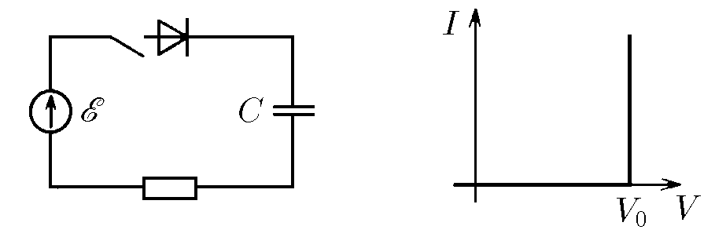

###  Условие:

$8.4.8.$ Диод имеет вольт-амперную характеристику, изображенную на рисунке. При напряжении $V_0$ диод открывается. Конденсатор вначале не заряжен. Какое количество теплоты выделится на сопротивлении после замыкания ключа?

###  Решение:

Рассмотрим случай, когда ЭДС батареи $\varepsilon > U_{0}$. Пусть сразу после замыка ния ключа ток в цепи равен $I_0$. Закон Ома для замкнутой цепи в этом случае будет иметь вид $\varepsilon = U_{0} + I_{0}R$, откуда $I_{0} = \frac{ \varepsilon - U_{0}}{R}$. Появившийся ток в цепи начнет заряжать конденсатор но по мере зарядки ток будет уменьшаться, и при напряжении на конденсаторе, равном $\varepsilon - U_{0}$, ток в цепи прекратится. Это будет новое стационарное состояние: ток $I=0$, а заряд на конденсаторе

$$
q = C( \varepsilon - U_{0} )
$$

За время зарядки конденсатора батарея совершит работу

$$
A = C( \varepsilon - U_{0}) \varepsilon
$$

Часть этой работы пойдет на работу по преодолению разности потенциалов $U_0$ внутреннею электрического поля диода:

$$
A_{д} = qU_{0} = C( \varepsilon - U_{0})U_{0}
$$

Вторая часть работы перейдет в энергию, запасенную конденсатором:

$$
W_{к} = \frac{q^{2} }{2C} = \frac{C( \varepsilon - U_{0} )^{2} }{2}
$$

И наконец, оставшаяся часть работы выделится в виде тепла в резисторе:

$$
Q = A - A_{д} - W_{к}
$$

$$
Q = C( \varepsilon - U_{0} ) \varepsilon - C( \varepsilon - U_{0} )U_{0} - \frac{C ( \varepsilon - U_{0})^{2} }{2}
$$

После перегрупировки

$$
Q = C( \varepsilon - U_{0} ) \left ( \varepsilon - U_{0} - \frac{ \varepsilon - U_{0} }{2} \right ) = \frac{C ( \varepsilon - U_{0} )^{2} }{2}
$$

#### Ответ:

$$
W=C({E}-V_0)^2/2, \varepsilon>V_0;\quad W=0, \varepsilon < V_0
$$