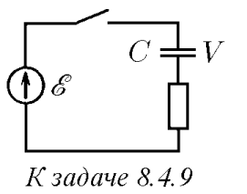

###  Условие: 

$8.4.9.$ Какое количество химической энергии запасается в аккумуляторе после замыкания ключа в электрической цепи, изображенной на рисунке? Какое количество теплоты выделяется при этом? 

 

###  Решение: 

После замыкания ключа и установления равновесного распределения зарядов: $U_{1} = \varepsilon \quad(1)$ Запишем закон сохранения энергии: $\frac{CU^{2}}{2} - \frac{CU_{1}^{2}}{2} = A_{ст}^{ \prime} + Q \quad(2)$ где ${A}'$ — работа против сторонних сил аккумулятора равна увеличению его химической энергии: $A_{ст}^{ \prime} = \varepsilon \Delta q$ $Q$ — выделившееся в схеме тепло. Учитывая, что заряд, прошедший через аккумулятор, $\Delta q = CU - CU_{1} = C (U - \varepsilon) \quad(4)$ из $(2,3)$ находим: $A_{ст}^{ \prime} = C \varepsilon (U - \varepsilon); Q = \frac{1}{2} C (U - \varepsilon)^{2};$ Из выражения для $A_{ст}^{ \prime}$ видно, что аккумулятор приобретает энергию при $U > \varepsilon$ и расходует ее при обратном соотношении. 

###  Ответ: $W = C(V − \varepsilon)\varepsilon;$ $W = C(V − \varepsilon)^2/2.$ 
