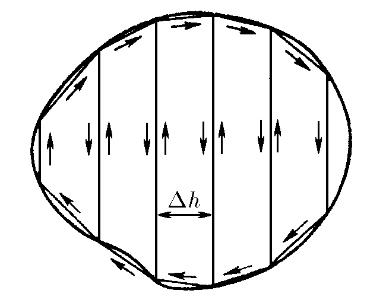

###  Условие

$9.1.10.$ Докажите, что момент сил, действующий на любую плоскую рамку с током в однородном магнитном поле индукции $B$, $\vec{N} = [\vec{M} \times \vec{B}]$.

### Доказательство

Разобьем произвольный контур вертикальными линиями, данные линии не внесут изменений в момент так как с одном стороны ток по ним идёт в одном направлении, а в соседнем контуре в обратном тогда для достаточно маленького разбиения это будут рамки, для которых мы уже доказывали это утверждение, тогда общее

$$
\vec{N} =\int{d\vec{N}} = \int{[d\vec{M} \times \vec{B}]}
$$

в скалярном виде будет выглядеть как:

$$
{N} =\int{d{M}{B}\sin\alpha}= BM\cdot \sin\alpha
$$

так как направление $\vec N$ и $\vec M$ у всех маленьких рамок совпадает, то справедливо, что у $\vec N$ и $d\vec N$ сонаправлены тогда очевидно, что:

$$
\boxed{\vec{N} = [\vec{M} \times \vec{B}]}
$$