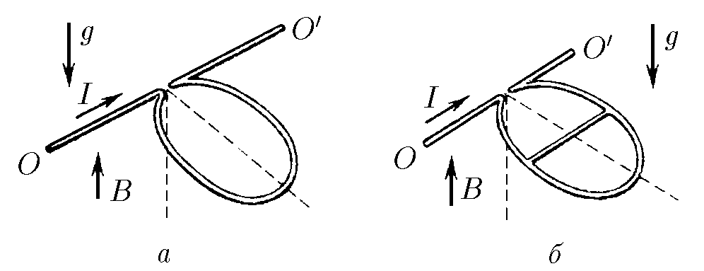

###  Условие

$9.1.11.$ а) Проволочная рамка в виде окружности с током может вращаться вокруг горизонтальной оси $OO^\prime$. Масса единицы длины проволоки $\rho$, ток в рамке $I$. Рамка находится в магнитном поле индукции B, направленном вдоль поля тяжести. Определите угол отклонения плоскости окружности от вертикали.

б) Проволочная рамка в виде окружности имеет по диаметру проволочную перемычку, параллельную горизонтальной оси $OO^\prime$ , вокруг которой рамка может вращаться. Масса единицы длины рамки и перемычки одинакова и равна $\rho$. Ток, входящий в рамку, равен $I$. Рамка находится в магнитном поле индукции $B$, направленном параллельно полю тяжести. На какой угол от вертикали отклонится рамка?

### Решение

а) Используя выражение для момента силы магнитного поля, полученного в [9.1.10](../9.1.10), $\vec{N} = [\vec{M} \times \vec{B}]$ получаем

$$
N = BIS\cdot \cos\alpha = \pi R^2BI \cdot \cos\alpha
$$

при этом момент силы тяжести:

$$
M_{mg} = Rmg\cdot \cos\alpha = 2\pi R^2\rho g\cdot \sin\alpha
$$

эти моменты равны:

$$
2\pi R^2\rho g \cdot \sin\alpha = \pi BI R^2 \cdot \cos\alpha
$$

после преобразований, получаем

$$
\boxed{\tan\alpha = \frac{BI}{2\rho g}}
$$

б) Найдём момент силы тяжести:

$$
M_{mg} = mgR\cdot \sin\alpha = (2\pi R + 2R)\rho gR \cdot \sin\alpha
$$

$$
M_{mg} = 2R^2\rho g(1+\pi ) \cdot \sin\alpha
$$

Теперь, изначальный контур представим как два наложенных контура с токами $I_1$ и $I_2$ такими что, $I = I_1 + I_2$, контур с $I_2$ — это полуокружность с перегородкой, контур с $I_1$ — это кольцо без перегородки, тогда из параллельного соединения следует что: $I_1\cdot \pi R = I_2 \cdot 2R$ тогда

$$
I_1 = I_2\cdot \frac{2}{\pi}
$$

$$
I = I_1 + I_2 = I_2\left(1+\frac{2}{\pi}\right)
$$

$$
I_1 = I\cdot \frac{2}{\pi +2}; \quad
$$

Тогда моменты для этих контуров:

$$
M_{k1} = BS_1\cdot \cos\alpha =\pi R^2I\cdot \frac{2}{\pi +2}B\cdot \cos\alpha
$$

$$
M_{k2} = BS_2\cdot \cos\alpha = \frac{1}{2}\pi R^2I\cdot \frac{\pi}{\pi +2}B\cdot \cos\alpha
$$

Суммарный момент контуров:

$$
M_k = \frac{1}{2}\pi R^2 BI \cdot \cos\alpha\cdot \frac{\pi + 4}{\pi +2}
$$

Приравняем этот момент и момент силы тяжести:

$$
\frac{1}{2}\pi R^2 BI \cdot \cos\alpha\cdot \frac{\pi + 4}{\pi +2} = 2R^2\rho g(1+\pi ) \cdot \sin\alpha
$$

отсюда

$$
\boxed{\tan\alpha = \frac{\pi (\pi +4)}{4(\pi +2)(\pi +1)} \cdot \frac{BI}{\rho g}}
$$

#### Ответ

$$
\tan\alpha = \frac{\pi (\pi +4)}{4(\pi +2)(\pi +1)} \cdot \frac{BI}{\rho g}
$$