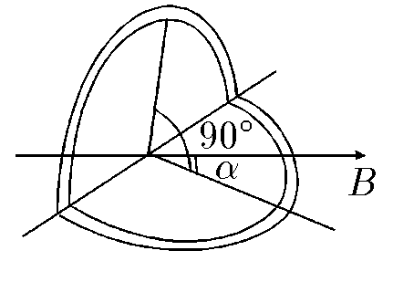

###  Условие

$9.1.12.$ Виток радиуса $R$ согнули по диаметру под прямым углом и поместили в однородное магнитное поле индукции B так, что одна из плоскостей витка оказалась расположенной под углом $\alpha$, другая — под углом $\frac{\pi}{2}-\alpha$ к направлению индукции $B$. Ток в витке $I$. Определите момент сил, действующих на виток.

### Решение

Разобьем контур на два контура с одинаковым током, но в разных плоскостях.

Найдем момент сил для каждого из них:

$$
M_1 = \frac{1}{2}\pi R^2IB\cdot \sin\alpha
$$

$$
M_2 = \frac{1}{2}\pi R^2IB\cdot \sin\left(\frac{\pi}{2} -\alpha\right) = \frac{1}{2}\pi R^2IB\cdot \cos\alpha
$$

Суммарный момент сил

$$
\boxed{M = M_1 + M_2 = \frac{1}{2}\pi R^2IB\cdot (\sin\alpha + \cos\alpha )}
$$

#### Ответ

$$
M = \frac{1}{2}\pi R^2IB\cdot (\sin\alpha + \cos\alpha )
$$