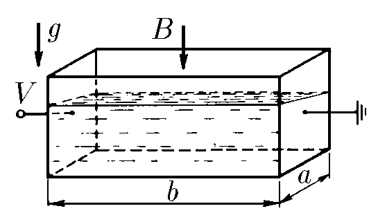

###  Условие

$9.1.4.$ В прямоугольную кювету, две противоположные стенки которой металлические, а остальные сделаны из изолятора, налит электролит, плотность которого $\rho$, удельная проводимость $\lambda$. К металлическим стенкам кюветы приложено напряжение $V$, и вся кювета помещена в однородное вертикальное магнитное поле индукции $B$. Определите разность уровней жидкости около неметаллических стенок кюветы. Длина кюветы $a$, ширина $b$.

### Решение

Сопротивление между подключенными контактами найдём как

$$
R = \frac{\rho l}{S} = \frac{l}{\lambda S}
$$

При напряжении $V$, по закону Ома, силу тока $I$ найдём как

$$
I = \frac{V}{R} = \frac{V\lambda S}{l} = \frac{V\lambda}{b}S\tag{1}
$$

Угол наклона уровня жидкости $\alpha$, выразим из условия равновесия, и через изменение уровня электролита $\Delta h$

$$
\tan\alpha = \frac{\Delta h}{a}=\frac{F}{mg}\tag{2}
$$

Из закона Ампера

$$
F = Ib \cdot B
$$

Подставляя значение силы тока $I$ из выражения $(1)$

$$
F= V\lambda SB= V\lambda a \left(h + \frac{\Delta h}{2}\right)
$$

Учитывая, что масса электролита $m = \rho hS$, перепишем выражение $(2)$

$$
\tan\alpha =\frac{V\lambda SB}{\rho hsg} \Rightarrow \boxed{\Delta h = \frac{V\lambda Ba}{h\rho g}}
$$

#### Ответ

$$
\Delta h = \frac{V\lambda Ba}{h\rho g}
$$

###  Альтернативное решение:

###  Альтернативное решение:

